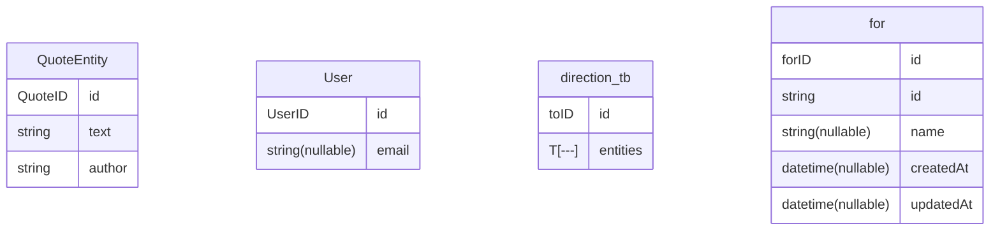

```mermaid
erDiagram
  QuoteEntity {
    QuoteID id
    string text
    string author
  }
  User {
    UserID id
    string(nullable) email
  }
  direction_tb {
    toID id
    T[---] entities
  }
  for {
    forID id
    string id
    string(nullable) name
    datetime(nullable) createdAt
    datetime(nullable) updatedAt
  }
```
